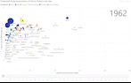

<h1> StarSharks README </h1>

 

## Global Analysis of Fish Production and Consumption
### Something Smells Fishy...

 

This document outlines the StarSharks' final project, including an [introduction and overview of the project](#introduction), steps on [how to navigate the folders](#repository-structure) in this Github Repository, a [walk through of our data processing](#etl), and what [technologies we used](#technologies-used).

  

## Introduction
As our final project, our team sought to investigate trends in global fish consumption, looking at how a country's consumption may be impacted by its production and the availability of other protein sources, and how its consumption may affect the overall life expectancy in the country. 

The primary questions we looked to answer in this investigation were:
1. Is there a correlation between fish consumption and production in a country?
2. How much do countries depend on fish for sustenance?
3. It's said that eating fish leads to healthier lives, is this true? 

 

## Repository Structure

The folders in this repository consist of:

[Data](./Data/), a folder holding the CSV files which we used to perform our data analysis.

[Workspaces](./Workspaces/), a folder containing our individual workspaces, where we carried out work in python notebooks.
- [Becca's Workspace](/Workspaces/Becca_workspace/)
- [Jesse's Workspace](/Workspaces/Jesses_workspace/)
- [Val's Workspace](/Workspaces/Vals_workspace/)

[Images](./Images/), a folder containing images referenced in the README, ETL, and visualization outputs from our code notebooks.

 

## ETL

Our ETL process for this project follows that outlined in the diagram above, and is explained in greater detail in our [ETL.md file, which you can explore by opening this link](./ETL.md). The linked document also addresses where we gathered our data from, providing links to the sources and brief descriptions of what each of them contains. 

 

## Technologies Used
- Python, including libraries such as:
    - Pandas
    - Matplotlib
    - Seaborn
    - Sklearn
    - Numpy
    - pySpark
    - confluentKafka
    - json
    - time
    - uuid
- Azure
    - Azure Databricks
    - Azure Data Studio
    - Azure Storage Explorer
- Kafka 
- Microsoft PowerBI

 

## Machine Learning
For our predictions, we used the LinearRegression model from the SKlearn library, looking to make predictions on Average Life Expectancy based on a location's Population, Fish Production, Fish Consumption, and the Continent it is located on. The code for this Machine Learning process are stored in [this python notebook](./Workspaces/Vals_workspace/ML-ETL-Life-Expect.ipynb), and some of the results are displayed below.

[Insert ML Results screenshots]

 

## Conclusions
In addressing the questions we presented for this investigation, we came to find some relatively surprising results. From the data we gathered, we were able to find a slightly positive correlation between the quantity of fish produced by a country and how much each person in that country consumes.

This correlation, however, is not strong enough to confidently guess how much an individual in a specific country might consume based on how much their country produces. On the contrary, it became evident that the top fish consuming countries in the world are not the same as the top fish producers; at times, the disparity in fish consumption between the two is relatively large. 

Further, it can be seen that countries with higher per capita consumption of fish get more even amounts of protein from meat + seafood as they do vegetable sources, whereas high fish producers get the majority of their protein from vegetable sources. 

Finally, in generating a predictive model to determine life expectancy based on some of our fish facts (fish production, consumption, as well as country population and location), we were able to produce a highly accurate predictive result. From this result, we could establish that there was a high correlation between fishing consumption and life expectancy of people within a country. This would support the question of "does eating fish lead to a longer life?", although it would be a bit more complicated to make the claim using our findings as a basis. 